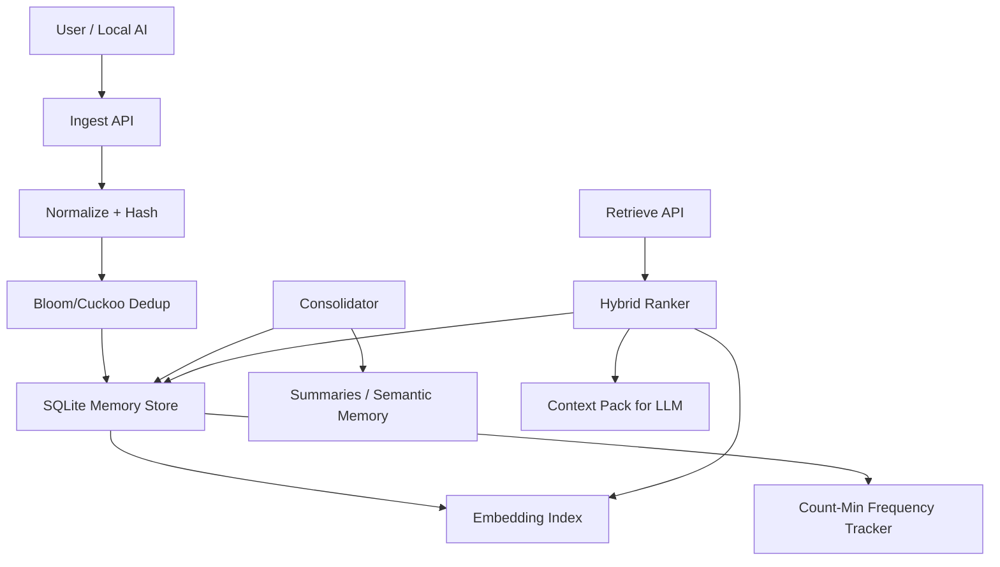

# ForgetfulDB

A local-first AI memory database for macOS that behaves like human memory
instead of an append-only vector store.

ForgetfulDB gives a local AI assistant **selective retention, lossy
compression, deduplication, decay, consolidation, and retrieval**:

- remembers recurring and useful information
- forgets low-value details (exponential decay per memory type)
- compresses related events into summaries during consolidation
- detects duplicates probabilistically (Bloom filter) and semantically
  (cosine similarity)
- marks stale or contradicted memories instead of silently keeping lies
- retrieves only a compact, relevant context pack for an LLM prompt

Everything runs locally: Rust + SQLite, no network calls, no model
downloads. `local_only = true` is the default and the HTTP server binds
to `127.0.0.1` only.

## Architecture



### Workspace layout

| Crate | Responsibility |
| --- | --- |
| `forgetfuldb-core` | Memory schema, scoring formula, decay curves, ingest heuristics, config |
| `forgetfuldb-store` | SQLite persistence (rusqlite, bundled), migrations, CRUD, ingest pipeline |
| `forgetfuldb-prob` | Bloom filter, Count-Min Sketch, HyperLogLog, reservoir sampling — all from scratch |
| `forgetfuldb-embed` | Pluggable `EmbeddingProvider` trait; v1 is a deterministic hashed bag-of-words |
| `forgetfuldb-retrieve` | Hybrid ranking: vector + keyword/tag + importance + recurrence + recency + decay |
| `forgetfuldb-consolidate` | The "sleep cycle": merge dups, summarize clusters, promote, archive, prune |
| `forgetfuldb-cli` | The `forgetfuldb` binary |
| `forgetfuldb-server` | Optional local HTTP API (axum) + OpenAI-compatible memory proxy |
| `forgetfuldb-agent` | Memory-wrapped chat loop around a local LLM (Ollama / llama-server) |
| `iforgot-chat` | The `iforgot` binary: casual terminal chat with automatic memory |

> **Why a Bloom filter?** Only for *"have I probably ingested this exact
> content before?"* checks during dedup. Bloom filters cannot do semantic
> retrieval — they have no notion of similarity. The SQLite `UNIQUE`
> constraint on `content_hash` remains the authoritative dedup mechanism;
> the filter just makes the common case fast.

### Memory model

Memories carry a type that controls how fast they fade:

| Type | Meaning | Default half-life |
| --- | --- | --- |
| `raw_event` | Verbatim input (chat turn, log line) | ~2 days |
| `episodic` | "What happened" | ~9 days |
| `semantic` | "What is true" — distilled facts | ~70 days |
| `procedural` | "How to do things" | ~70 days |
| `preference` | User preferences | ~35 days |
| `archive` | Compressed/retired, excluded from normal retrieval | — |

Decay: `decay_score = importance_score * exp(-lambda * age_days)`.
**Pinned memories never decay.** **Stale memories** (contradicted or
updated by newer ones) are only retrievable with `--include-stale`.

Retrieval score:

```text
retrieval_score =
  ( 0.45 * semantic_similarity
  + 0.20 * importance_score      (decay-adjusted)
  + 0.15 * recurrence_score
  + 0.10 * recency_score
  + 0.10 * pinned_boost
  - 0.20 * staleness_penalty )
  * conversational_damping       (chat-path only, see below)
```

Two chat-path refinements keep retrieval honest:

- **Relevance gate** — memories scoring below `min_retrieval_score` are
  not injected even if `top_k` isn't filled. An empty memory block beats
  a misleading one.
- **Conversational damping** — verbatim chat turns (chat-sourced
  `raw_event`/`episodic` memories) get their score multiplied by
  `conversational_damping` (default 0.6), so an old conversation can't
  hijack the current one. Distilled `semantic`/`preference`/`procedural`
  memories are unaffected — consolidation is the path back to full rank.

Every retrieved memory comes with a full per-component score breakdown so
you can see *why* it was selected.

## Installation (macOS, Apple Silicon)

```bash
# Rust toolchain if you don't have it
curl --proto '=https' --tlsv1.2 -sSf https://sh.rustup.rs | sh

git clone https://github.com/kishore-nikhil/iforgot.git
cd iforgot
cargo install --path crates/forgetfuldb-cli
# or just: cargo build --release  ->  target/release/forgetfuldb
```

SQLite is bundled (compiled into the binary), so there are no system
dependencies beyond the Xcode command-line tools.

## Usage

```bash
# 1. Create forgetfuldb.toml + the SQLite database in the current directory
forgetfuldb init

# 2. Remember things
forgetfuldb ingest --text "Plot Perfect billing runs on Stripe with monthly invoices" \
    --source chat --tag project:plotperfect --memory-type semantic
forgetfuldb ingest --text "I always prefer dark mode in every editor" \
    --source chat --memory-type preference

# 3. Ask for context
forgetfuldb retrieve --query "What do I know about Plot Perfect billing?" --top-k 10

# 4. Let it sleep: dedup, summarize, promote, archive, prune
forgetfuldb consolidate

# Housekeeping
forgetfuldb stats
forgetfuldb inspect --id mem_0123456789abcdef
forgetfuldb pin --id mem_0123456789abcdef        # never decays
forgetfuldb pin --id mem_0123456789abcdef --off
forgetfuldb archive --id mem_0123456789abcdef

# Optional local HTTP API on 127.0.0.1
forgetfuldb server --port 8787
```

`retrieve` prints a JSON context pack:

```json
{
  "query": "What do I know about Plot Perfect billing?",
  "generated_at": 1780000000,
  "memories": [
    {
      "id": "mem_3f8a...",
      "content": "Plot Perfect billing runs on Stripe with monthly invoices",
      "memory_type": "semantic",
      "topic": "plotperfect",
      "tags": ["project:plotperfect"],
      "pinned": false,
      "stale": false,
      "score": {
        "semantic_similarity": 0.81,
        "importance": 0.64,
        "recurrence": 0.2,
        "recency": 0.97,
        "pinned_boost": 0.0,
        "staleness_penalty": 0.0,
        "total": 0.62
      }
    }
  ]
}
```

### HTTP API

| Route | Body |
| --- | --- |
| `POST /ingest` | `{"text": "...", "source": "chat", "tags": ["project:x"], "memory_type": "semantic"}` |
| `POST /retrieve` | `{"query": "...", "top_k": 10, "include_stale": false}` |
| `POST /consolidate` | `{}` (empty) |
| `GET /memory/:id` | — |
| `GET /stats` | — |
| `GET /metrics` | — (chat token/context metrics) |
| `POST /v1/chat/completions` | OpenAI-compatible memory proxy (see below) |

```bash
curl -s localhost:8787/ingest -H 'content-type: application/json' \
  -d '{"text": "standup moved to 9:30", "source": "calendar"}'
curl -s localhost:8787/retrieve -H 'content-type: application/json' \
  -d '{"query": "when is standup", "top_k": 5}'
```

## iforgot: chat with memory built in

`iforgot` is a terminal chat where memory updates itself. Every message
you send is ingested (write), every reply is grounded in retrieved
memories (read — which also counts as rehearsal and slows decay), the
assistant's replies are stored as fast-decaying raw events, and per-turn
token metrics are logged for context optimization. The LLM stays
stateless; ForgetfulDB is the state.

```bash
ollama pull gemma3:12b          # or any chat model
cargo install --path crates/iforgot-chat
iforgot                         # uses forgetfuldb.toml in the cwd
```

On first run (or whenever the configured model isn't installed) `iforgot`
lists the models on your backend and saves your pick to the config:

```text
  no model selected
  models installed on the backend:
    1. gemma4:12b
    2. llama3.2:3b
  select a model [1-2] ❯ 1
  model set to gemma4:12b (saved to forgetfuldb.toml)
```

Switch anytime with `iforgot --model <name>` or `/model [name]` in chat —
the choice persists, and the memory database is untouched (the chat model
only affects generation, never storage or embeddings).

```text
   _ _____                          _
  (_)  ___|__  _ __ __ _  ___  ___ | |_
  | | |_ / _ \| '__/ _` |/ _ \/ _ \| __|
  | |  _| (_) | |  | (_| | (_) | (_) | |_
  |_|_|  \___/|_|   \__, |\___/ \___/ \__|
                    |___/

you ❯ what editor theme do I like?
iforgot ❯ You prefer dark mode.
  ⏺ 1 memories | prompt 123 tok | reply 5 tok | retrieve 3ms | llm 1200ms
```

### Context vs memory: keeping the live conversation in charge

Old memories must *support* the current conversation, never replace it.
Four mechanisms work together (all configurable under `[chat]`):

- **Contextual retrieval** (`query_context_turns`, default 2): the last
  few raw user messages are folded into the retrieval query — never into
  the prompt — so a vague follow-up like *"something catchier"* still
  retrieves memories about what the conversation is actually about,
  instead of whatever those three words match in storage.
- **Relevance gate** (`min_retrieval_score`, default 0.25): weak matches
  are dropped rather than injected. No memories beats wrong memories.
- **Conversational damping** (`conversational_damping`, default 0.6):
  verbatim turns from old chats are down-weighted in retrieval so a past
  conversation can't hijack the present one. Facts distilled by
  consolidation rank normally.
- **Session exclusion**: each chat memory is tagged `session:<id>`, and
  retrieval skips the live session's own turns — they're already in the
  prompt as history, so re-injecting them as "memories" would only waste
  tokens and compete with the real context.

The memory block itself is framed as *background from past sessions* and
the system prompt tells the model the live conversation wins on conflict.
The longer-term plan — a rolling per-session working-memory summary that
consolidates into long-term memory when the session ends — is documented
in [docs/evolving-context.md](docs/evolving-context.md).

In-chat commands: `/cmd <command>` (run a shell command directly),
`/tools` (list available tools), `/prompt` (show the system prompt),
`/model [name]` (list installed models or switch), `/memories` (show the
context pack behind the last answer, with score breakdowns), `/metrics`,
`/stats`, `/consolidate`, `/pin <id>`, `/unpin <id>`, `/stale <id>`,
`/inspect <id>`, `/quit`.

Replies are rendered with lightweight **streaming Markdown** — headings,
lists, bold/italic and `code` are styled inline as tokens arrive, so you
keep streaming and get readable output instead of raw `**asterisks**`.
While you wait for the first token (retrieval, model load on a cold
start, prompt evaluation) a small **spinner** animates after the
`iforgot ❯` prefix and erases itself the moment the reply starts; it's
skipped automatically when output isn't a terminal.

The backend is configured in `forgetfuldb.toml` under `[chat]`:
`backend = "ollama"` uses Ollama's native API (exact token counts);
`backend = "openai_compat"` works with llama-server (llama.cpp),
LM Studio, or anything OpenAI-shaped. When `local_only = true`, only
localhost URLs are accepted — and the workspace builds reqwest without
TLS, so remote https endpoints are unreachable by construction.

### Tools: let the assistant do things

The assistant can run **tools** — starting with a shell command tool — so
you can ask in plain English and approve the action:

```text
you ❯ what's my device IP?
iforgot ❯
  ⚙ shell wants to run:
    ipconfig getifaddr en0
  run it? [Enter/y = run, anything else = cancel] ❯ y
    192.168.1.42
iforgot ❯ Your device IP is **192.168.1.42** (interface en0).
```

The LLM can only *propose* a command (via a hidden ```` ```tool ```` block
that never reaches your screen); **nothing runs until you confirm** with
Enter/y. Run a command yourself without the LLM via `/cmd ls -la`.

Small local models often ignore the structured protocol and just *show* a
command in a ```` ```bash ```` / ```` ```sh ```` block. iForgot detects
that too and offers the same confirmation prompt, so "what's my IP?" leads
to a runnable command regardless of how well the model follows
instructions.

Tools are a small trait — adding one is a single `impl` plus a line of
registration in `forgetfuldb-tools` (see the crate docs), so the same
confirmation flow, `/tools` listing, and server endpoints apply to every
future custom tool. Configure under `[tools]`: `enabled`, `shell_enabled`,
`shell_timeout_secs`.

On the **server**, `GET /tools` lists tools and `POST /tools/execute`
runs one — but execution is **off by default** (`allow_server_execute`),
because an HTTP endpoint can't ask a human to confirm. Enable it only on a
trusted local machine.

### The memory proxy: give any chat UI long-term memory

`forgetfuldb server` also exposes **`POST /v1/chat/completions`** — an
OpenAI-compatible endpoint that ingests the user's message, injects
retrieved memories as a system message, forwards the request to your
local LLM, ingests the reply, and records metrics. Point any
OpenAI-compatible client (Open WebUI, IDE plugins, scripts using an
OpenAI SDK) at `http://127.0.0.1:8787/v1` and it gains memory with zero
integration work:

```bash
forgetfuldb server --port 8787
curl -s localhost:8787/v1/chat/completions -H 'content-type: application/json' \
  -d '{"messages":[{"role":"user","content":"what did I decide about pricing?"}]}'
```

Streaming (`"stream": true`) is passed through verbatim (in that mode the
reply isn't captured for ingestion and token usage isn't recorded;
context metrics still are).

### Latency design

Memory adds almost nothing to conversation latency, by construction:

- **Replies stream** token-by-token in the terminal and through the proxy.
- **Cache-friendly prompts.** The system prompt and history stay
  byte-identical across turns; retrieved memories are attached to the
  *current user message* (and, in the proxy, injected just before it).
  Everything before the new message therefore hits the LLM server's
  prefix KV-cache, so each turn only evaluates new tokens — with a 12B
  model that's the difference between milliseconds and seconds before
  the first token.
- **Async memory writes.** Only retrieval (a few ms) runs on the
  conversation path. Ingest and metrics are queued to a background
  writer thread with its own SQLite connection (WAL); the user-message
  write happens while the model generates, and each turn flushes the
  (in practice already-empty) queue first so retrieval always sees
  prior turns.
- **`keep_alive`** (default `"30m"`, under `[chat]`) keeps the model
  loaded in Ollama between turns, avoiding a full model reload after an
  idle pause.

If the first token is still slow, shrink the prompt: lower `top_k` and
`history_turns`, and check `/metrics` for the context share.

### Token & context metrics

Every chat turn (terminal or proxy) records a row in `chat_turns`:
prompt/completion tokens (exact from Ollama; reported usage or absent
from OpenAI-compat backends), context share, retrieval vs LLM latency,
and which memory IDs were injected. View it with `forgetfuldb metrics`,
`/metrics` in chat, or `GET /metrics` — this is the dataset for tuning
`top_k`, retrieval weights, and summary sizes against real numbers later.

### Plugging in models elsewhere

The `Summarizer` trait in `forgetfuldb-consolidate` and the
`EmbeddingProvider` trait in `forgetfuldb-embed` are the remaining seams
where local models plug in — consolidation summaries via Ollama, real
embeddings via fastembed/candle/Core ML — without touching the rest of
the system. Run `forgetfuldb consolidate` nightly (launchd/cron) either
way.

## Where memories live

By default every session — no matter which directory you launch from —
uses the **shared global store** at `~/.forgetfuldb/` (created
automatically, named `"main"`, with an absolute database path). That's
what keeps memories intact across sessions. Resolution order:

1. `--config <path>` — explicit store
2. `./forgetfuldb.toml` in the working directory — a deliberate
   **project-local** store (create one with `forgetfuldb init`, which
   names it after the directory; `--name` overrides)
3. `~/.forgetfuldb/forgetfuldb.toml` — the global `"main"` store

Every store has a friendly `name` shown in the `iforgot` banner and
`forgetfuldb stats` (`memory "main" (global) | db ~/.forgetfuldb/...`),
so it's always clear which memory a session is talking to. If a stray
`forgetfuldb.sqlite3` from an older cwd-relative session is found in the
working directory while the global store is active, a note tells you so
those memories aren't silently orphaned. Relative `sqlite_path` values
resolve against the config file's directory, never the cwd.

## Configuration

See [`forgetfuldb.example.toml`](forgetfuldb.example.toml) for every
knob: store name, decay lambdas per memory type, retrieval weights,
consolidation thresholds, archive/delete windows, `[chat]` settings, and
`local_only`.

## Testing

```bash
cargo test            # unit + integration tests across all crates
```

Covered: decay math, the retrieval formula, stale penalties, pinned
behavior, Bloom/CMS/HLL/reservoir properties, duplicate detection,
consolidation merge logic, and full init → ingest → retrieve →
consolidate lifecycles against a real SQLite file.

## Limitations (v1, by design)

- **Placeholder embeddings.** Hashed bag-of-words captures lexical
  overlap, not meaning: "car" and "automobile" don't match. Retrieval is
  hybrid (keywords + tags + recency + importance), which papers over this
  for personal-scale use, but a real local embedding model is the single
  biggest upgrade.
- **Brute-force similarity.** Retrieval and duplicate detection scan all
  rows (retrieval O(n), dedup O(n²)). Comfortable to tens of thousands of
  memories; an ANN index (HNSW) is the fix when that stops being true.
- **Heuristic NLP.** Entity extraction is keyword frequency; topic
  detection is tag/keyword-based; contradiction detection requires
  explicit `contradicts`/`updates` links — nothing infers contradictions
  from text yet.
- **Extractive summaries.** Cluster summaries quote the most central
  member texts rather than abstracting them.
- **Single-writer.** One process at a time (CLI *or* server). WAL mode is
  on, but there's no multi-process coordination.

## Roadmap

1. **Real local embeddings**: fastembed or candle backend; Core ML /
   MLX on Apple Silicon; embedding versioning + re-embedding migration.
2. **LLM summarizer**: `Summarizer` implementation backed by Ollama /
   llama.cpp for abstractive consolidation and contradiction detection.
3. **ANN index** (HNSW) once brute force stops being instant.
4. **Cuckoo filter** to replace Bloom where deletion support matters
   (forgetting a hash when its memory is deleted).
5. **Working memory / evolving context**: a rolling per-session summary
   between live history and long-term retrieval, consolidated into
   episodic/semantic memories at session end (subsumes session-aware
   consolidation) — design in
   [docs/evolving-context.md](docs/evolving-context.md).
6. **launchd timer** template for nightly consolidation on macOS.
7. **MCP server** so any MCP-capable assistant can use ForgetfulDB as a
   memory tool directly.
