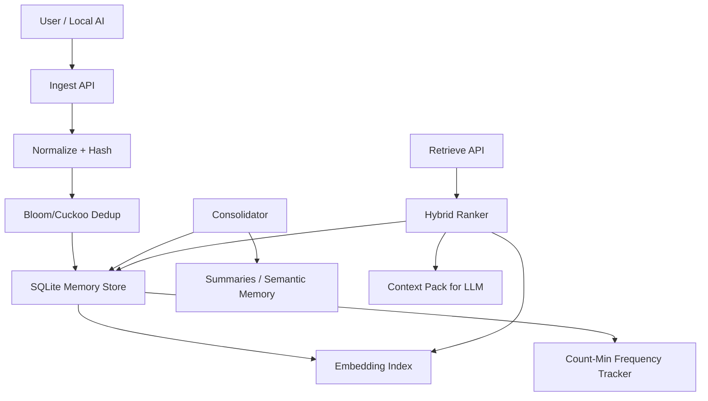

# ForgetfulDB

A local-first AI memory database for macOS that behaves like human memory
instead of an append-only vector store.

ForgetfulDB gives a local AI assistant **selective retention, lossy
compression, deduplication, decay, consolidation, and retrieval**:

- remembers recurring and useful information
- forgets low-value details (exponential decay per memory type)
- compresses related events into summaries during consolidation
- detects duplicates probabilistically (Bloom filter) and semantically
  (cosine similarity)
- marks stale or contradicted memories instead of silently keeping lies
- retrieves only a compact, relevant context pack for an LLM prompt

Everything runs locally: Rust + SQLite, no network calls, no model
downloads. `local_only = true` is the default and the HTTP server binds
to `127.0.0.1` only.

## Architecture



### Workspace layout

| Crate | Responsibility |
| --- | --- |
| `forgetfuldb-core` | Memory schema, scoring formula, decay curves, ingest heuristics, config |
| `forgetfuldb-store` | SQLite persistence (rusqlite, bundled), migrations, CRUD, ingest pipeline |
| `forgetfuldb-prob` | Bloom filter, Count-Min Sketch, HyperLogLog, reservoir sampling — all from scratch |
| `forgetfuldb-embed` | Pluggable `EmbeddingProvider` trait; v1 is a deterministic hashed bag-of-words |
| `forgetfuldb-retrieve` | Hybrid ranking: vector + keyword/tag + importance + recurrence + recency + decay |
| `forgetfuldb-consolidate` | The "sleep cycle": merge dups, summarize clusters, promote, archive, prune |
| `forgetfuldb-cli` | The `forgetfuldb` binary |
| `forgetfuldb-server` | Optional local HTTP API (axum) |

> **Why a Bloom filter?** Only for *"have I probably ingested this exact
> content before?"* checks during dedup. Bloom filters cannot do semantic
> retrieval — they have no notion of similarity. The SQLite `UNIQUE`
> constraint on `content_hash` remains the authoritative dedup mechanism;
> the filter just makes the common case fast.

### Memory model

Memories carry a type that controls how fast they fade:

| Type | Meaning | Default half-life |
| --- | --- | --- |
| `raw_event` | Verbatim input (chat turn, log line) | ~2 days |
| `episodic` | "What happened" | ~9 days |
| `semantic` | "What is true" — distilled facts | ~70 days |
| `procedural` | "How to do things" | ~70 days |
| `preference` | User preferences | ~35 days |
| `archive` | Compressed/retired, excluded from normal retrieval | — |

Decay: `decay_score = importance_score * exp(-lambda * age_days)`.
**Pinned memories never decay.** **Stale memories** (contradicted or
updated by newer ones) are only retrievable with `--include-stale`.

Retrieval score:

```text
retrieval_score =
    0.45 * semantic_similarity
  + 0.20 * importance_score      (decay-adjusted)
  + 0.15 * recurrence_score
  + 0.10 * recency_score
  + 0.10 * pinned_boost
  - 0.20 * staleness_penalty
```

Every retrieved memory comes with a full per-component score breakdown so
you can see *why* it was selected.

## Installation (macOS, Apple Silicon)

```bash
# Rust toolchain if you don't have it
curl --proto '=https' --tlsv1.2 -sSf https://sh.rustup.rs | sh

git clone https://github.com/kishore-nikhil/iforgot.git
cd iforgot
cargo install --path crates/forgetfuldb-cli
# or just: cargo build --release  ->  target/release/forgetfuldb
```

SQLite is bundled (compiled into the binary), so there are no system
dependencies beyond the Xcode command-line tools.

## Usage

```bash
# 1. Create forgetfuldb.toml + the SQLite database in the current directory
forgetfuldb init

# 2. Remember things
forgetfuldb ingest --text "Plot Perfect billing runs on Stripe with monthly invoices" \
    --source chat --tag project:plotperfect --memory-type semantic
forgetfuldb ingest --text "I always prefer dark mode in every editor" \
    --source chat --memory-type preference

# 3. Ask for context
forgetfuldb retrieve --query "What do I know about Plot Perfect billing?" --top-k 10

# 4. Let it sleep: dedup, summarize, promote, archive, prune
forgetfuldb consolidate

# Housekeeping
forgetfuldb stats
forgetfuldb inspect --id mem_0123456789abcdef
forgetfuldb pin --id mem_0123456789abcdef        # never decays
forgetfuldb pin --id mem_0123456789abcdef --off
forgetfuldb archive --id mem_0123456789abcdef

# Optional local HTTP API on 127.0.0.1
forgetfuldb server --port 8787
```

`retrieve` prints a JSON context pack:

```json
{
  "query": "What do I know about Plot Perfect billing?",
  "generated_at": 1780000000,
  "memories": [
    {
      "id": "mem_3f8a...",
      "content": "Plot Perfect billing runs on Stripe with monthly invoices",
      "memory_type": "semantic",
      "topic": "plotperfect",
      "tags": ["project:plotperfect"],
      "pinned": false,
      "stale": false,
      "score": {
        "semantic_similarity": 0.81,
        "importance": 0.64,
        "recurrence": 0.2,
        "recency": 0.97,
        "pinned_boost": 0.0,
        "staleness_penalty": 0.0,
        "total": 0.62
      }
    }
  ]
}
```

### HTTP API

| Route | Body |
| --- | --- |
| `POST /ingest` | `{"text": "...", "source": "chat", "tags": ["project:x"], "memory_type": "semantic"}` |
| `POST /retrieve` | `{"query": "...", "top_k": 10, "include_stale": false}` |
| `POST /consolidate` | `{}` (empty) |
| `GET /memory/:id` | — |
| `GET /stats` | — |

```bash
curl -s localhost:8787/ingest -H 'content-type: application/json' \
  -d '{"text": "standup moved to 9:30", "source": "calendar"}'
curl -s localhost:8787/retrieve -H 'content-type: application/json' \
  -d '{"query": "when is standup", "top_k": 5}'
```

### Connecting to a local LLM (e.g. Ollama)

ForgetfulDB is the memory; your assistant loop is the brain. A typical
loop with Ollama:

1. user says something → `POST /ingest` (or `forgetfuldb ingest`)
2. before answering → `POST /retrieve` with the user's question and
   paste the context pack into the system prompt
3. nightly (launchd/cron) → `POST /consolidate`

```bash
QUERY="what did I decide about plot perfect pricing?"
CONTEXT=$(forgetfuldb retrieve --query "$QUERY" --top-k 5)
ollama run llama3.2 "Relevant memories:\n$CONTEXT\n\nQuestion: $QUERY"
```

The `Summarizer` trait in `forgetfuldb-consolidate` and the
`EmbeddingProvider` trait in `forgetfuldb-embed` are the two seams where
local models plug in later — consolidation summaries via Ollama, real
embeddings via fastembed/candle/Core ML — without touching the rest of
the system.

## Configuration

`forgetfuldb init` writes `forgetfuldb.toml` next to the database. See
[`forgetfuldb.example.toml`](forgetfuldb.example.toml) for every knob:
decay lambdas per memory type, retrieval weights, consolidation
thresholds, archive/delete windows, and `local_only`.

## Testing

```bash
cargo test            # unit + integration tests across all crates
```

Covered: decay math, the retrieval formula, stale penalties, pinned
behavior, Bloom/CMS/HLL/reservoir properties, duplicate detection,
consolidation merge logic, and full init → ingest → retrieve →
consolidate lifecycles against a real SQLite file.

## Limitations (v1, by design)

- **Placeholder embeddings.** Hashed bag-of-words captures lexical
  overlap, not meaning: "car" and "automobile" don't match. Retrieval is
  hybrid (keywords + tags + recency + importance), which papers over this
  for personal-scale use, but a real local embedding model is the single
  biggest upgrade.
- **Brute-force similarity.** Retrieval and duplicate detection scan all
  rows (retrieval O(n), dedup O(n²)). Comfortable to tens of thousands of
  memories; an ANN index (HNSW) is the fix when that stops being true.
- **Heuristic NLP.** Entity extraction is keyword frequency; topic
  detection is tag/keyword-based; contradiction detection requires
  explicit `contradicts`/`updates` links — nothing infers contradictions
  from text yet.
- **Extractive summaries.** Cluster summaries quote the most central
  member texts rather than abstracting them.
- **Single-writer.** One process at a time (CLI *or* server). WAL mode is
  on, but there's no multi-process coordination.

## Roadmap

1. **Real local embeddings**: fastembed or candle backend; Core ML /
   MLX on Apple Silicon; embedding versioning + re-embedding migration.
2. **LLM summarizer**: `Summarizer` implementation backed by Ollama /
   llama.cpp for abstractive consolidation and contradiction detection.
3. **ANN index** (HNSW) once brute force stops being instant.
4. **Cuckoo filter** to replace Bloom where deletion support matters
   (forgetting a hash when its memory is deleted).
5. **Session-aware consolidation**: summarize per session, then across
   sessions.
6. **launchd timer** template for nightly consolidation on macOS.
7. **MCP server** so any MCP-capable assistant can use ForgetfulDB as a
   memory tool directly.
